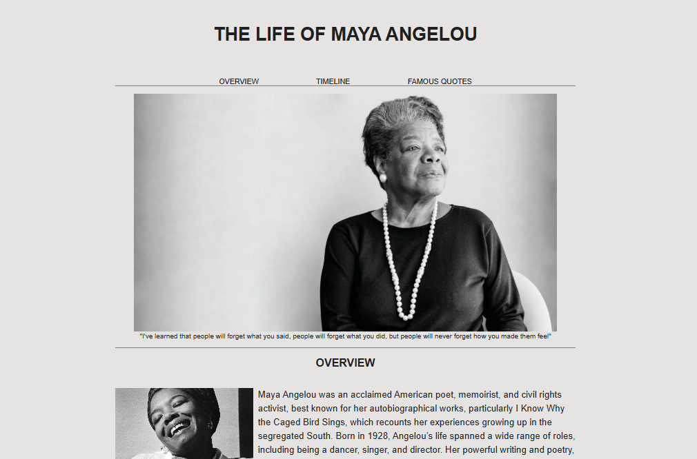
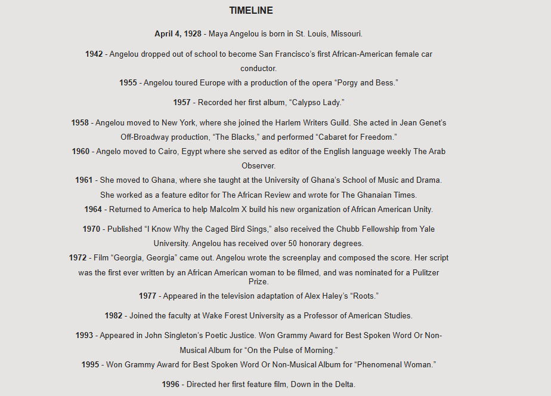
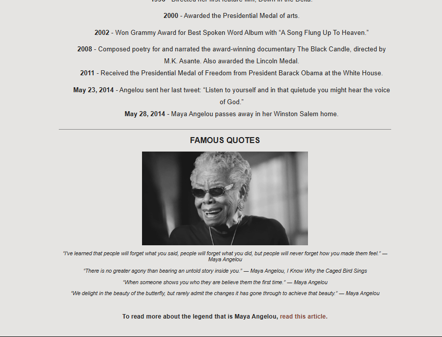

# Tribute Page

This is a **Tribute Page** project created as part of the [freeCodeCamp Responsive Web Design Certification](https://www.freecodecamp.org/learn/2022/responsive-web-design/).

## 📋 Project Description

The Tribute Page honours the late American memoirist, poet and civil rights activist, Maya Angelou, by presenting information using semantic HTML and responsive layout. It includes structured text, an image, and a link to more information.

The purpose of this project is to demonstrate:
- Semantic HTML5 usage
- Responsive design principles
- Basic CSS styling
- Clean structure and readability

## 🚀 Live Demo

[Click here to view the live project](https://moagi-t.github.io/tribute-page/)  

## 📸 Screenshots

